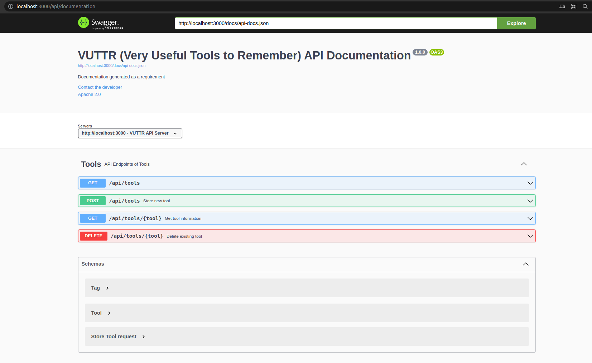

# VUTTR (Very Useful Tools to Remember) (BACKEND)

[](https://github.com/apteles/vuttr/actions/workflows/laravel.yml)

# Requisitos

Todos os requisitos foram implementados tendo como base o [link](https://github.com/gustavo-startaideia/desafio-backend).

### Tecnologias

-   [Laravel](<>).
-   [Docker](<>).
-   [Docker Compose](<>).
-   [Mysql](<>).

## Executando o projeto

Com o `docker` >=v20.10.7 e `docker-compose` >=v1.26.2 instalado em sua máquina basta apenas executar o seguinte comando:

```sh
$ docker-compose up -d
```

Executado o comando acima, será criado 4 serviços.

```sh
❯ docker ps
CONTAINER ID   IMAGE           COMMAND                  CREATED             STATUS             PORTS                                                    NAMES
f1aa4194c9f7   backend_nginx   "nginx -g 'daemon of…"   About an hour ago   Up About an hour   0.0.0.0:3000->80/tcp, :::3000->80/tcp                    vuttr-nginx
09446f04c5bc   backend_app     "dockerize -template…"   About an hour ago   Up About an hour   9000/tcp                                                 vuttr-app
9ca37e90d62e   redis:alpine    "docker-entrypoint.s…"   About an hour ago   Up About an hour   6379/tcp                                                 vuttr-redis
c2839595105c   backend_db      "docker-entrypoint.s…"   About an hour ago   Up About an hour   33060/tcp, 0.0.0.0:33006->3306/tcp, :::33006->3306/tcp   vuttr-db
```

## Testes

```sh
❯ docker-compose exec app bash -c "vendor/bin/phpunit"
```

## Ferramentas adicionais

Foi adicionado o PHP_CodeSniffer, com o propósito de melhorar a leitura e manter uma padronização minima.

## Documentação da API

Foi usado o swagger para prover uma documentação mais clara possível dos recursos disponíveis nesse projeto. Para acessar basta acessar o
recurso `http://localhost:3000/api/documentation`. Após já ter executado o passo de **Executando o Projeto** mencionado nesse documento, uma página semelhante a imagem abaixo será apresentada, veja:



## Troubleshooting

Caso ocorra algum problema relacionado a falta de alguma table no momento de fazer
consulta pare os serviços rodando com o comando `docker-compose down` execute o comando abaixo, posteriormente suba os serviços novamente com o comando `docker-compose up`

```sh
❯ rm -rf .docker/dbdata && mkdir -p .docker/dbdata
```

# VUTTR (Very Useful Tools to Remember) (FRONTEND)

# Requisitos

Todos os requisitos foram implementados tendo como base o [link](https://github.com/gustavo-startaideia/desafio-frontend).

### Tecnologias

-   [React](<>).
-   [Axios](<>).
-   [Styled Components](<>).

## Executando o projeto

Ao entrar na pasta frontend execute o comando `yarn start`. Executado o comando será aberto uma janela do navegador que irá rodar na porta `3000`.

Obs.: É necessário que seja iniciado o backend em um primeiro momento, posteriormente o frontend. Como o servidor está sendo executado na porta `3000`, na execução do frontend será solicitado uma confirmação para o mesmo seja aberto na próxima porta disponível, caso esteja disponível será a `3001`.

## Licença


